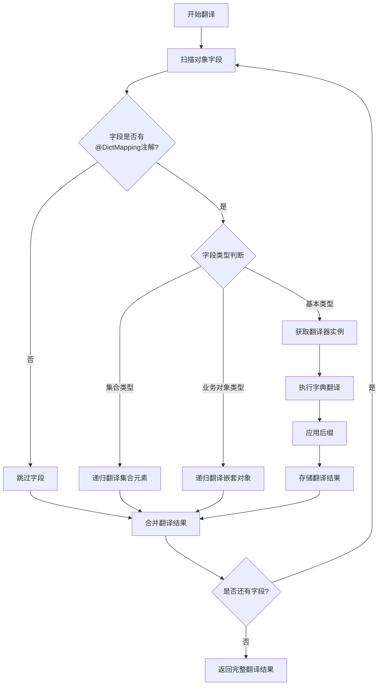

# Common-Dict 通用字典工具

一个简洁优雅的 Java 字典翻译工具，帮助开发者轻松实现业务对象中编码字段的自动翻译功能。

## 🚀 核心特性

- **零侵入性设计** - 仅需实现接口和添加注解，无需修改现有业务逻辑
- **自动递归翻译** - 支持嵌套对象和集合的深度翻译
- **灵活的翻译策略** - 支持自定义翻译器，满足复杂业务场景
- **高性能缓存** - 内置字典缓存机制，避免重复查询
- **反向查找支持** - 支持通过字典值反向查找字典键

## 📦 快速开始

### Maven 依赖

```xml
<dependency>
    <groupId>cn.creekmoon</groupId>
    <artifactId>common-dict</artifactId>
    <version>0.0.3</version>
</dependency>
```

### 基础使用

**1. 定义字典数据**

```java
// 初始化字典数据
Map<String, Map<String, String>> dictMap = new HashMap<>();
dictMap.put("status", Map.of("1", "已启用", "0", "已禁用"));
dictMap.put("level", Map.of("1", "初级", "2", "中级", "3", "高级"));
Dict.setDictMap(dictMap);

// 设置业务包路径（用于递归翻译）
Dict.setGlobalBusinessPackageNames("com.yourcompany.domain");
```

**2. 定义业务对象**

```java
@Data
public class User implements Dict {
    private String name;
    
    @DictMapping
    private String status = "1";  // 将翻译为: "已启用"
    
    @DictMapping(suffix = "用户")
    private String level = "2";   // 将翻译为: "中级用户"
}
```

**3. 获取翻译结果**

```java
User user = new User();
user.setName("张三");

// 方式1: 获取翻译结果（不影响原对象）
JSONObject dictResult = user.getDict();
System.out.println(dictResult.getString("status")); // 输出: "已启用"
System.out.println(dictResult.getString("level"));  // 输出: "中级用户"

// 方式2: 填充到原对象
user.fillSelf();
System.out.println(user.getStatus()); // 输出: "已启用"
System.out.println(user.getLevel());  // 输出: "中级用户"
```

## 🎯 实际应用场景

### 场景一：用户管理系统

在用户管理系统中，经常需要将状态码、角色编码等转换为可读的文字。

```java
@Data
public class UserInfo implements Dict {
    private String userName;
    
    @DictMapping  // 使用字段名 'userStatus' 作为字典类型
    private String userStatus = "ACTIVE";
    
    @DictMapping(dictCode = "role", suffix = "权限")
    private String roleCode = "ADMIN";
    
    @DictMapping
    private String departmentCode = "TECH";
}

// 字典配置
Map<String, Map<String, String>> dictMap = new HashMap<>();
dictMap.put("userStatus", Map.of(
    "ACTIVE", "活跃",
    "INACTIVE", "停用",
    "PENDING", "待审核"
));
dictMap.put("role", Map.of(
    "ADMIN", "管理员",
    "USER", "普通用户"
));
dictMap.put("departmentCode", Map.of(
    "TECH", "技术部",
    "SALES", "销售部"
));
Dict.setDictMap(dictMap);

// 使用示例
UserInfo user = new UserInfo();
JSONObject result = user.getDict();
// 结果: {"userStatus": "活跃", "roleCode": "管理员权限", "departmentCode": "技术部"}
```

### 场景二：订单系统

处理订单状态、支付方式等多种编码字段的翻译。

```java
@Data
public class Order implements Dict {
    private String orderId;
    
    @DictMapping
    private String orderStatus = "PAID";
    
    @DictMapping
    private String paymentMethod = "ALIPAY";
    
    @DictMapping(dictCode = "logistics", suffix = "配送")
    private String logisticsType = "EXPRESS";
    
    // 嵌套对象也会自动翻译
    private OrderItem orderItem = new OrderItem();
}

@Data
public class OrderItem implements Dict {
    @DictMapping
    private String itemStatus = "IN_STOCK";
}

// 字典配置
dictMap.put("orderStatus", Map.of(
    "PENDING", "待支付",
    "PAID", "已支付",
    "SHIPPED", "已发货",
    "DELIVERED", "已送达"
));
dictMap.put("paymentMethod", Map.of(
    "ALIPAY", "支付宝",
    "WECHAT", "微信支付",
    "BANK", "银行卡"
));
dictMap.put("logistics", Map.of(
    "EXPRESS", "快递",
    "PICKUP", "自提"
));
dictMap.put("itemStatus", Map.of(
    "IN_STOCK", "有库存",
    "OUT_OF_STOCK", "缺货"
));

// 使用 - 自动处理嵌套对象
Order order = new Order();
JSONObject result = order.getDict();
/* 结果:
{
    "orderStatus": "已支付",
    "paymentMethod": "支付宝", 
    "logisticsType": "快递配送",
    "orderItem": {
        "itemStatus": "有库存"
    }
}
*/
```

### 场景三：集合数据翻译

处理列表数据的批量翻译。

```java
@Data
public class Department implements Dict {
    private String deptName;
    
    @DictMapping
    private String deptType = "TECH";
    
    private List<Employee> employees = Arrays.asList(
        new Employee("MANAGER"), 
        new Employee("DEVELOPER")
    );
}

@Data
public class Employee implements Dict {
    private String name;
    
    @DictMapping
    private String position;
    
    public Employee(String position) {
        this.position = position;
    }
}

// 字典配置
dictMap.put("deptType", Map.of(
    "TECH", "技术部门",
    "SALES", "销售部门"
));
dictMap.put("position", Map.of(
    "MANAGER", "经理",
    "DEVELOPER", "开发工程师",
    "TESTER", "测试工程师"
));

// 使用 - 自动处理集合中的所有对象
Department dept = new Department();
JSONObject result = dept.getDict();
/* 结果:
{
    "deptType": "技术部门",
    "employees": [
        {"position": "经理"},
        {"position": "开发工程师"}
    ]
}
*/
```

### 场景四：自定义翻译器

当默认翻译逻辑无法满足需求时，可以实现自定义翻译器。

```java
// 自定义翻译器 - 将数字评分转换为星级显示
public class StarRatingTranslator implements DictFieldTranslator {
    @Override
    public String searchDictValue(Object dictObject, Field sourceField, 
                                 Object fieldValue, DictMapping annotation) {
        if (fieldValue == null) return null;
        
        int score = Integer.parseInt(fieldValue.toString());
        return "★".repeat(Math.max(0, Math.min(5, score))) + annotation.suffix();
    }
}

@Data
public class ProductReview implements Dict {
    private String reviewText;
    
    @DictMapping(suffix = " 星好评", fieldTranslator = StarRatingTranslator.class)
    private String rating = "4";  // 将翻译为: "★★★★ 星好评"
}
```

### 场景五：多值字典翻译器

当字段包含多个逗号分隔的值需要分别翻译时，可以使用内置的多值字典翻译器。

```java
@Data
public class TaskInfo implements Dict {
    // 多值字段翻译：1,2,3 -> 未开始,进行中,已完成
    @DictMapping(fieldTranslator = MultiValueDictFieldTranslator.class)
    private String taskStatus = "1,2,3";
    
    // 部分匹配：1,2,3,4 -> 未开始,进行中,已完成,4
    @DictMapping(dictCode = "taskStatus", fieldTranslator = MultiValueDictFieldTranslator.class)
    private String mixedStatus = "1,2,3,4";
    
    // 带后缀：HIGH,LOW -> 高优先级任务,低优先级任务
    @DictMapping(dictCode = "priority", suffix = "任务", 
                 fieldTranslator = MultiValueDictFieldTranslator.class)
    private String priorityWithSuffix = "HIGH,LOW";
    
    // 标签系统：TAG1,TAG2,TAG3 -> 重要,紧急,优先
    @DictMapping(dictCode = "tags", fieldTranslator = MultiValueDictFieldTranslator.class)
    private String taskTags = "TAG1,TAG2,TAG3";
}

// 字典配置
dictMap.put("taskStatus", Map.of(
    "1", "未开始",
    "2", "进行中", 
    "3", "已完成"
));
dictMap.put("priority", Map.of(
    "HIGH", "高优先级",
    "MEDIUM", "中优先级",
    "LOW", "低优先级"
));
dictMap.put("tags", Map.of(
    "TAG1", "重要",
    "TAG2", "紧急",
    "TAG3", "优先"
));

// 使用示例
TaskInfo task = new TaskInfo();
JSONObject result = task.getDict();
/* 结果:
{
    "taskStatus": "未开始,进行中,已完成",
    "mixedStatus": "未开始,进行中,已完成,4",
    "priorityWithSuffix": "高优先级任务,低优先级任务",
    "taskTags": "重要,紧急,优先"
}
*/
```

**多值翻译器特性：**
- ✅ **自动分割**: 按逗号分隔多个值
- ✅ **逐个翻译**: 对每个值单独进行字典查找
- ✅ **容错处理**: 没找到翻译的值保持原样
- ✅ **自动拼接**: 翻译后用逗号重新组合
- ✅ **后缀支持**: 支持添加统一后缀

**翻译效果对照表：**

| 输入值 | 字典配置 | 翻译结果 |
|-------|---------|---------|
| `"1,2,3"` | `{"1":"未开始", "2":"进行中", "3":"已完成"}` | `"未开始,进行中,已完成"` |
| `"1,2,3,4"` | `{"1":"未开始", "2":"进行中", "3":"已完成"}` | `"未开始,进行中,已完成,4"` |
| `"HIGH,LOW"` + 后缀`"任务"` | `{"HIGH":"高优先级", "LOW":"低优先级"}` | `"高优先级任务,低优先级任务"` |
| `"X,Y,Z"` | 无匹配 | `"X,Y,Z"` |

**适用场景：**
- 任务状态组合（多个并行状态）
- 标签系统（对象的多个标签翻译）
- 权限组合（用户的多个角色权限）
- 分类系统（商品的多个分类）

```

## 🔧 高级功能

### 反向查找

通过字典值查找对应的字典键：

```java
// 通过字典值获取字典键
String dictKey = Dict.searchDictKey("orderStatus", "已支付");  // 返回: "PAID"
```

### 获取字典数据

```java
// 获取指定字典类型的所有键值对
Map<String, String> statusDict = Dict.getKeysMap("orderStatus");

// 获取所有字典数据
Map<String, Map<String, String>> allDict = Dict.getAll();
```

### 静态方法翻译

无需实现 Dict 接口也可以进行翻译：

```java
// 直接翻译指定字段
String result = Dict.searchDictValue("orderStatus", "PAID");  // 返回: "已支付"

// 翻译对象（对象无需实现 Dict 接口）
JSONObject result = Dict.getDict(anyObject);

// 填充对象
Dict.fillSelf(anyObject);
```

## 📝 注解配置说明

### @DictMapping 注解参数

| 参数 | 说明 | 默认值 | 示例 |
|------|------|--------|------|
| `dictCode` | 字典类型编码 | 使用字段名 | `@DictMapping(dictCode = "status")` |
| `suffix` | 翻译结果后缀 | 空字符串 | `@DictMapping(suffix = "权限")` |
| `fieldTranslator` | 自定义翻译器 | DefaultDictFieldTranslator | `@DictMapping(fieldTranslator = CustomTranslator.class)` |

### 字段类型支持

- ✅ String 类型字段
- ✅ 基本数据类型（int, long 等）
- ✅ 包装类型（Integer, Long 等）
- ✅ null 值处理
- ✅ 嵌套对象
- ✅ 集合类型

## ⚡ 性能优化建议

1. **字典数据缓存**: 字典数据会自动缓存在内存中，避免重复设置
2. **翻译器实例复用**: 自定义翻译器全局只创建一个实例，确保线程安全
3. **批量翻译**: 对于集合数据，使用 `Dict.getDict()` 比逐个翻译更高效

## 🔍 技术细节

### 核心架构

本工具基于反射和注解技术实现，核心组件包括：

1. **Dict 接口**: 提供字典翻译的主要功能入口
2. **@DictMapping 注解**: 标记需要翻译的字段及翻译配置  
3. **DictFieldTranslator 接口**: 定义字段翻译逻辑的扩展点
4. **DefaultDictFieldTranslator**: 默认的字典翻译实现
5. **MultiValueDictFieldTranslator**: 内置的多值字典翻译器，处理逗号分隔的多值翻译

### 翻译流程



### 核心实现原理

#### 1. 字典缓存机制

```java
// 正向字典缓存：字典类型 -> 字典键 -> 字典值
static Map<String, Map<String, String>> DICT_MAP = new ConcurrentHashMap<>(512);

// 反向字典缓存：字典类型 -> 字典值 -> 字典键列表
static Map<String, Map<String, List<String>>> DICT_MAP_REVERSE = new ConcurrentHashMap<>(512);
```

#### 2. 翻译器缓存机制

```java
// 翻译器实例缓存，避免重复创建
Map<Class, DictFieldTranslator> translators = new ConcurrentHashMap<>();
```

#### 3. 递归翻译判断

工具通过以下策略判断对象是否需要递归翻译：

- 实现了 `Dict` 接口的对象
- 属于配置的业务包路径下的类
- 集合类型（会遍历集合中的每个元素）

#### 4. 线程安全保证

- 字典缓存使用 `ConcurrentHashMap` 确保并发安全
- 翻译器实例全局唯一，要求实现必须线程安全
- 反射操作通过 `setAccessible()` 临时开放访问权限后立即恢复

### 扩展点

#### 自定义翻译器接口

```java
public interface DictFieldTranslator {
    /**
     * 获取翻译结果
     * @param dictObject  来源翻译的整个对象
     * @param sourcefield 来源字段本身
     * @param fieldValue  来源字段本身的值
     * @param annotationValue 来源字段携带的注解值
     * @return 翻译结果
     */
    String searchDictValue(Object dictObject, Field sourcefield, 
                          Object fieldValue, DictMapping annotationValue);
}
```

通过实现此接口，可以完全自定义字段的翻译逻辑，支持复杂的业务场景需求。

---

## 📄 License

Apache License 2.0

## 👨‍💻 作者

- **creekmoon** - *项目创建者* - [GitHub](https://github.com/creekmoon)

---

*让字典翻译变得简单优雅 ✨*